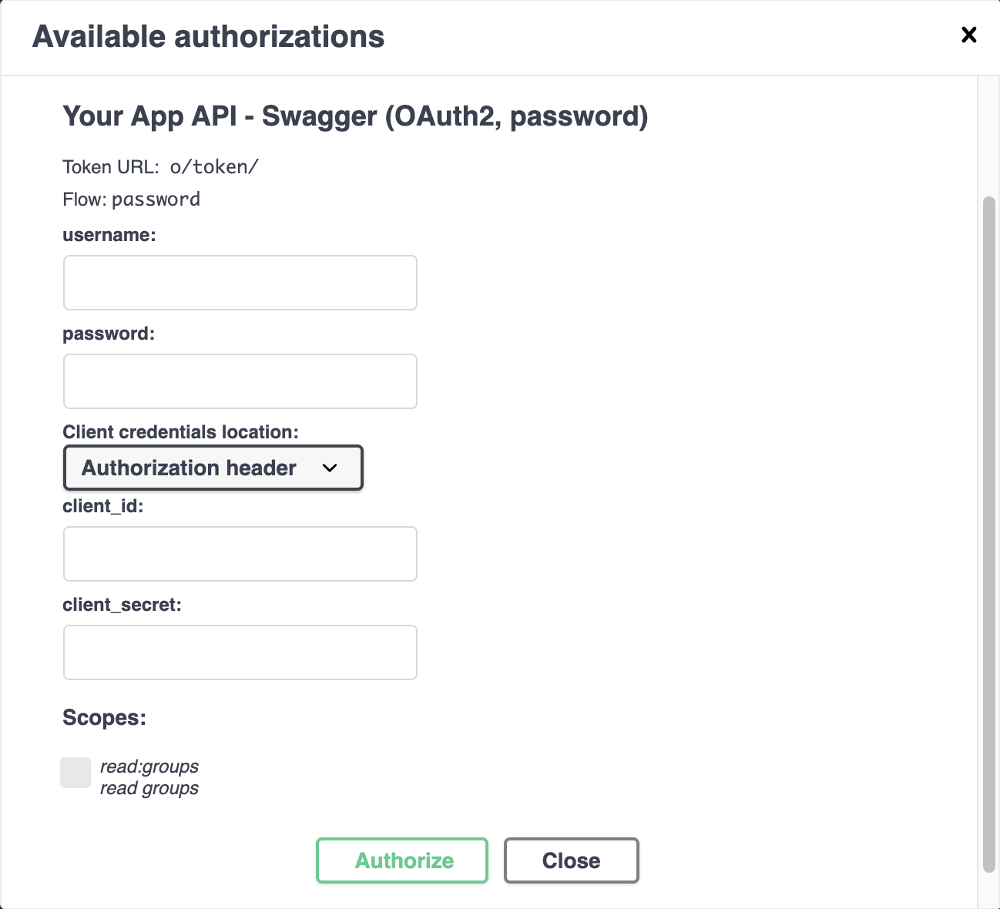

# Strip Controller Master

Provides a backend as a REST API for [sc-web](https://github.com/brunopk/sc-web). It's built on [Django Rest Framework](https://django-rest-framework.org) for Python 3.8.

## Starting the API

1. Create a virtual environment (if wasn't done before).
2. Activate the virtual environment: `source <path of the venv>/bin/activate`.
3. Install dependencies: `pip install -r requirements.txt`.
4. Create migrations on `app/migrations` : `python manage.py makemigrations` *
5. Create database and apply migrations: `python manage.py migrate` *
6. [Create Django superuser](#Creating-Django-superuser).
7. [Configure authentication](#Configure-authentication).  
8. Start the server: Init the server: `python manage.py runserver`

* required only the first time running the server or when [adding new models](#Creating-new-models))

The output of `python manage.py runserver` will show URL, 

> The default URL is: http://localhost:8000. 

To run the server on different port use:

```
$ python manage.py runserver localhost:<port>
```

## Creating a virtual environment (venv)

```
python3 -m venv <path of the venv>
```

or

```
virtualenv -m <path to the python interpreter> <path of the venv>
```

## Creating Django superuser

```python manage.py createsuperuser```

It is also possible to create normal user (not superusers).

## Configure authentication

Authentication to the API is done using Oauth2 protocol with the "password" flow. It is **requiered** to allow sc-web to connect to sc-master or [test endpoints](#Swagger-interactive-documentation). 

First, register an application on http://localhost:8000/o/applications/. Click on the link to create a new application and fill the form with the following data:

- Name: just a name of your choice
- Client Type: confidential
- Authorization Grant Type: Resource owner password-based

> Remember the client id and the client password to connect sc-web to sc-master or [test endpoints](#Swagger-interactive-documentation).


## Creating new models

1. Create a new module with the model class on `app/models/`.
2. Import the model on `app/models/__init__.py` (for instance `from .new_model import NewModel`)
3. Delete `db.sqlite3`.
4. Create migrations: `python manage.py makemigrations`.
5. Apply migrations on database: `python manage.py migrate`.

To run the API again, repeat steps 6 y 7 mentioned on *Starting the API* to recreate OAuth2 configurations which are saved on database.

## Swagger interactive documentation

> Interactive Swagger API documentation is shown opening http://localhost:8000 on any browser.

- JSON: http://localhost:8000/swagger.json
- YAML: http://localhost:8000/swagger.yaml
- swagger-ui: http://localhost:8000/swagger/

To authenticate open the authorize dialog on  http://localhost:8000, and complete the corresponding fields:



The user and password credentials are set when you [create a new django user](#Creating-Django-superuser).

## Future improvements:

- PostgreSQL or MongoDB (currently it's working with Sqlite).
- Implement endpoint for token refreshing.

## Links

- [Creation of virtual environments](https://docs.python.org/3/library/venv.html)
- [Quickstar Django REST Framework](http://www.django-rest-framework.org/tutorial/quickstart/)
- [Django OAuth Toolkit](https://django-oauth-toolkit.readthedocs.io/en/latest/rest-framework/getting_started.html)
- [Django API Documentation](https://github.com/axnsan12/drf-yasg)
